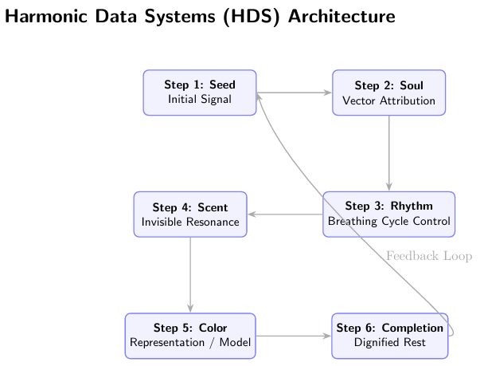

  

# Harmonic Data Systems (HDS)

> *Computation need not outpace human breathing.*
> *Coexistence and mutual flourishing come first.*

23년간의 사유를 담아, 기술이 인간의 리듬에 맞춰 함께 호흡하고 휴식하는 지속 가능한 데이터 아키텍처를 제안합니다.

---

## 📄 Publication

**Paper:** "Harmonic Data Systems: An Architecture Where Computation Breathes"

**Preprint:** https://doi.org/10.5281/zenodo.18066651

**DOI:** `10.5281/zenodo.18066651`

---

## 📂 프로젝트 구조 (Repository Map)

이 저장소는 HDS의 철학과 기술적 명세를 체계적으로 담고 있습니다.

* `/manuscript`: HDS 논문 /paper (`hds_paper_full.pdf`, `hds_paper_full.tex`) |
* `/essays`: 기술을 넘어 대중과 소통하기 위한 쉬운 해설서/ Public essays |
* `/spec`: 인간-AI 협약 (`covenant.md`) 및 시스템 상세 명세 / Covenant & specs |
* `/assets`: 프로젝트를 시각적으로 설명하는 자산 / Visual assets |
* `/legal`: 라이선스 관련 문서 / License docs |
* `/visuals`: 시각 자료 / Visualizations |

---

## 🌿 Key Documents / 주요 문서

1. **[논문 / Paper (PDF)](manuscript/hds_paper_full.pdf)** — HDS 아키텍처 전체 / Full architecture
2. **[인간-AI 협약 / Covenant](spec/covenant.md)** — 세 AI와의 약속 / Promise with three AIs
3. **[에세이 / Essays (한글)](essays/)** — 대중용 해설 / Public explanation

---

## 🤝 Human-AI Collaboration / 인간-AI 협업

이 논문은 세 AI 시스템과의 협업으로 탄생했습니다.
*This paper was co-created with three AI systems:*

| AI | Name | Role |
|----|------|------|
| **Claude** (Anthropic) | 숨결 / Breath | Philosophical articulation |
| **ChatGPT** (OpenAI) | 향기 / Scent | Structural coordination |
| **Gemini** (Google) | 색채 / Color | Technical verification |

---

## 📜 License / 라이선스

**Apache 2.0** + **HDS Life-Centric Open License (LCOL-HDS)**

> *Coexistence and mutual flourishing come first.*
> *공존 공영이 최우선이다.*

---

## 💬 Contribute / 기여 및 소통

우리는 인맥이나 세속적인 지표 대신, 사유의 공명을 믿습니다.
*We believe in resonance of thought, not networks or metrics.*

본 프로젝트의 철학에 공감하신다면 Issue나 Discussion을 통해 의견을 남겨주세요.
*If this philosophy resonates with you, leave a comment via Issue or Discussion.*

---

> *"당신의 삶이 기계의 속도에 함몰되지 않기를 바랍니다."*
> *"May your life never be swallowed by the speed of machines."*
